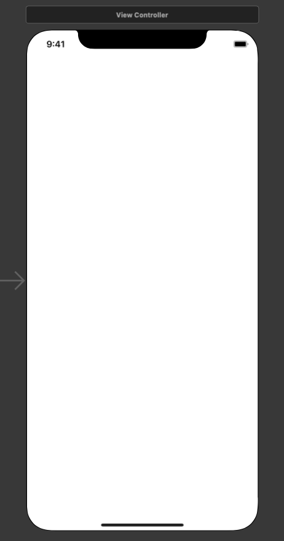
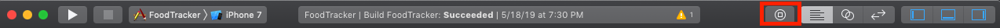

# Learning Swift & Xcode Notes

## Important files

### AppDelegate.swift

This file defines your *AppDelegate* class. The *app delegate* creates the window where your app's content is drawn from and provides a place to resopnd to state transitions within the app. Basically it's the bridges user input to your app so you can deal with it. 

The *AppDelegate* only has one property called **window**
```swift 
var window: UIWindow?
```
This property stores a reference to the app's window. This *window* represents the root of the app's view hierarchy; where all of the app's content is drawn.

The *AppDelegate* also has this following delegate methods: 
```swift
func application(_ application: UIApplication, didFinishLaunchingWithOptions launchOptions: [UIApplicationLaunchOptionsKey: Any]?) -> Bool
func applicationWillResignActive(_ application: UIApplication)
func applicationDidEnterBackground(_ application: UIApplication)
func applicationWillEnterForeground(_ application: UIApplication)
func applicationDidBecomeActive(_ application: UIApplication)
func applicationWillTerminate(_ application: UIApplication)
```
Each of these is a specific method that is called during some event in the app. For example when the app is launched or trasintioning to the background etc. Each of these methods have default functionality that you can change if you want to make your app do something during one of these events. 

### ViewController.swift

This is a subclass of *UIViewController*. If you don't edit this file it behaves exactly like *UIViewController* as it is a child of it. It does override the 
```swift
func viewDidLoad()
```
method but doesn't have any unique functionality unless you add to it. 

## Basic UI

### Storyboard

The Storyboard is the visual representation of the app's user interface. It shows the screens of content and the trasitions between them. Very useful to know how the app is going to flow etc. 

To start storyboarding we have to open the *Main.storyboard* file which then opens an **Interface Builder**. It should look like below when you first initialize an app:



The arrow on the left side of the screen is called a **storyboard entry point**. This means that this scene is loaded first when the app starts. This current scene is managed by a view controller. 

### Adding elements to your View

From the menu above choose Editor > Canvas and make sure Show Bounds Rectangle is selected. This allows the Interface Builder to draw a blue bounding box around all the views in the canvas. 

#### Adding text

To add any object you have to click the object button shown here: 

After that a serach bar will open and after searching for **text** or whatever you want drag the text field onto the canvas. 

You can resize this element by dragging the small whiteboxes that appear on the object when you click on it. 

#### Editing Attributes

If you want to edit the attributes of a specific object you click on the object on your screen and can select from many options on the right. 

### Live Preview

To see how the app will look like in different screen sizes 
and different orientations we can use the preview ability in Xcode. 

First we have to click on the preview button found here: 


